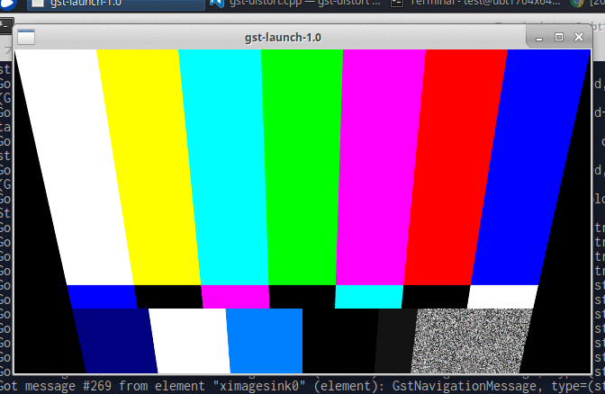

gst-distort
====
OpenCV2とGStreamerの組み合わせサンプル。



cv::getPerspectiveTransform()を使用した台形補正のサンプル。

``` c++
static GstFlowReturn
gst_distort_transform_frame(GstVideoFilter *obj,
                                    GstVideoFrame *inframe, GstVideoFrame *outframe)
{
    GstDistort *filter;
    GstDistortClass *fclass;
    GstFlowReturn ret;

    filter = GST_DISTORT(obj);
    fclass = GST_DISTORT_GET_CLASS(filter);

    cv::Mat img_src(filter->img_height, filter->img_width, CV_8UC3, inframe->data[0]);
    cv::Mat img_dst(filter->img_height, filter->img_width, CV_8UC3, outframe->data[0]);

    float w = img_src.cols;
    float h = img_src.rows;

    const cv::Point2f p_src[4]={
                cv::Point2f(0, 0),
                cv::Point2f(w, 0),
                cv::Point2f(w, h),
                cv::Point2f(0, h)};

    float offset_x = w / 8;

    const cv::Point2f p_dst[4]={
                cv::Point2f(0, 0),
                cv::Point2f(w, 0),
                cv::Point2f(w - offset_x, h),
                cv::Point2f(offset_x, h)};

    const cv::Mat mat_h = cv::getPerspectiveTransform(p_src, p_dst);

    cv::warpPerspective(img_src, img_dst, mat_h, img_src.size());

    return GST_FLOW_OK;
}
```

参考
----
* https://github.com/GStreamer/gst-plugins-bad/blob/master/gst-libs/gst/opencv/gstopencvvideofilter.h
* https://github.com/GStreamer/gst-plugins-bad/blob/master/gst-libs/gst/opencv/gstopencvvideofilter.cpp
* https://github.com/GStreamer/gst-plugins-bad/blob/master/gst-libs/gst/opencv/gstopencvutils.cpp#L98

Copyright and license
----
Copyright (c) 2017 yoggy

Released under the [MIT license](LICENSE.txt)
